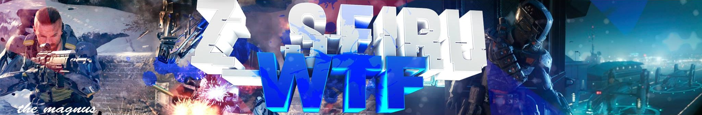
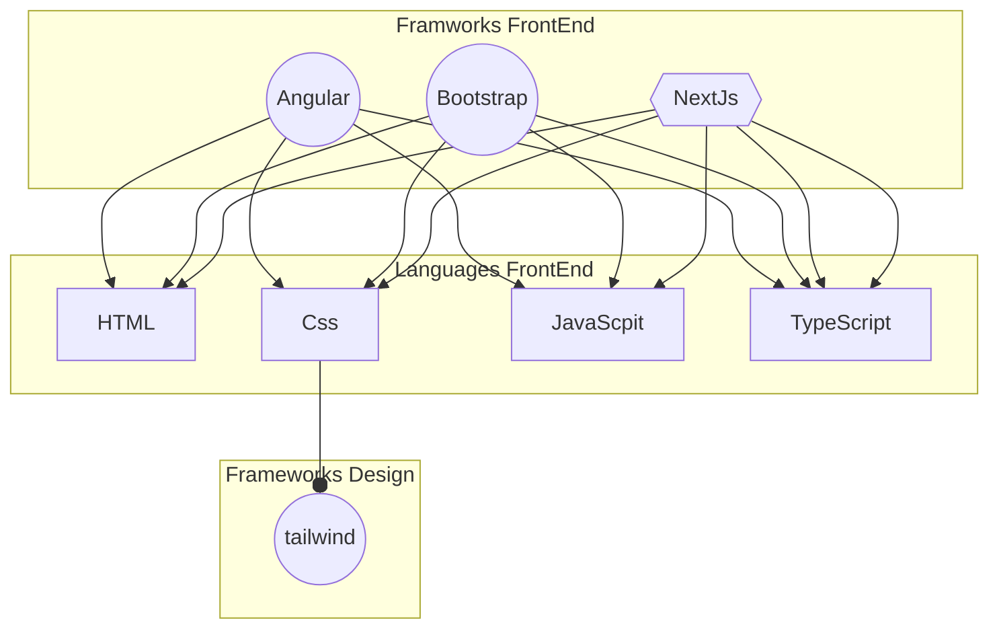
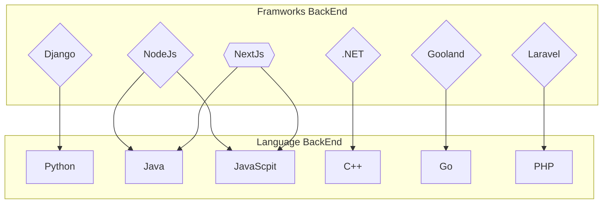
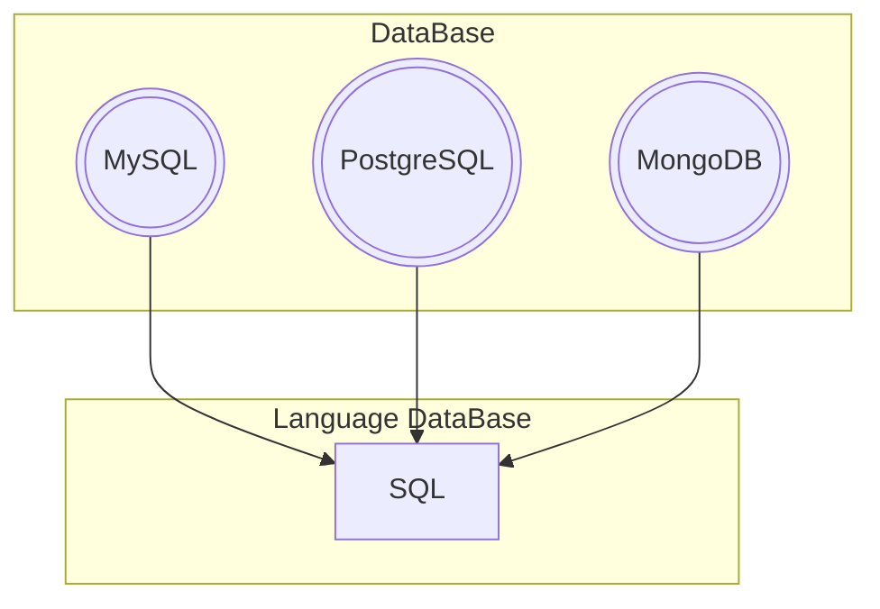

<h1 align="center">Hi, I'm <a href="[https://github.com/Zseiru15)]">Camilo Ordoñez </a></h1>

  

<h2 align="center"> &nbsp;GitHub ⚙️ Analytics&nbsp; </h2>

<a href="https://github.com/Zseiru15">
  

  

  

  <!-- 

 codigo de wakatime (Windows Defender detecto irregularidades)-->

<!-- <table align="center">
<tr border="none">
<td width="50%" align="center">

<a href="https://github.com/Zseiru15">
  

  

  

<td width="50%" align="center">

  

  </td>
</tr>
</table> Ctrl+k+c para comentar-->

##
<h2 align="center">🏆 &nbsp;GitHub Trophies&nbsp; 🏆</h2>

  

  

<h2 align="center">💼 &nbsp;My Projects&nbsp; 💼</h2>

  

<!-- 
 -->

<h1 align="center">🧠 &nbsp;Next Learning&nbsp; 🧠</h1>

<table>
<h2 align="center"> Languages </h2>

  

<h2 align="center">📁 &nbsp;Databases&nbsp; 📁</h2>

  

<h2 align="center">📚 &nbsp;Frameworks&nbsp; 📚</h2>

  

<h2 align="center">☁️ &nbsp;Cloud Services&nbsp; ☁️</h2>

  

<h2 align="center">🔧 &nbsp;Tools&nbsp; 🔧</h2>

  

<h2 align="center">💻 &nbsp;Operating Systems&nbsp; 💻</h2>

  

</a>

<h2 align="center">📋 &nbsp;Technologies&nbsp; 📋</h2>

</table>

