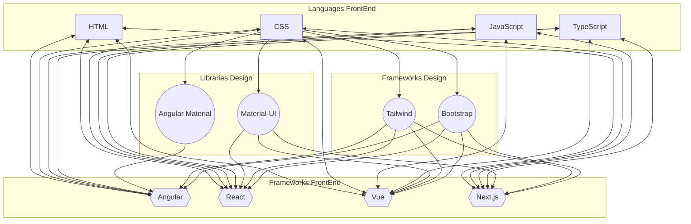
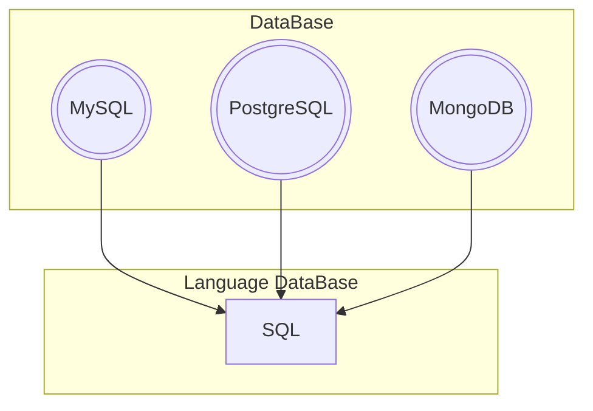

<h1 align="center">Hi, I'm <a href="[https://github.com/Zseiru15)]">Camilo Ordoñez </a></h1>

  

<h2 align="center"> &nbsp;GitHub ⚙️ Analytics&nbsp; </h2>

<a href="https://github.com/Zseiru15">
  

  

  

  <!-- 

 codigo de wakatime (Windows Defender detecto irregularidades)-->

<!-- <table align="center">
<tr border="none">
<td width="50%" align="center">

<a href="https://github.com/Zseiru15">
  

  

  

<td width="50%" align="center">

  

  </td>
</tr>
</table> Ctrl+k+c para comentar-->

##
<h2 align="center">🏆 &nbsp;GitHub Trophies&nbsp; 🏆</h2>

  

  

<h2 align="center">💼 &nbsp;My Projects&nbsp; 💼</h2>

<!-- 
 -->

<h1 align="center">🧠 &nbsp;Next Learning&nbsp; 🧠</h1>

<table>
<h2 align="center">🌍 &nbsp;Languages&nbsp; 🌍</h2>

  <!-- SPANISH -->
  
  <!-- ENGLISH -->
  
  <!-- PORTUGUESE -->
  <img src="https://img.shields.io/badge/PORTUGUESE-A2-red?style=for-the-badge&logo=data:image/svg+xml;base64,PHN2ZyB4bWxucz0iaHR0cDovL3d3dy53My5vcmcvMjAwMC9zdmciIHhtbG5zOnhsaW5rPSJodHRwOi8vd3d3LnczLm9yZy8xOTk5L3hsaW5rIiB3aWR0aD0iMTAwMCIgaGVpZ2h0PSI3MDAiIHZpZXdCb3g9Ii0yMTAwIC0xNDcwIDQyMDAgMjk0MCI+PGRlZnM+PHBhdGggaWQ9ImoiIGZpbGwtcnVsZT0iZXZlbm9kZCIgZD0iTS0zMS41IDBoMzNhMzAgMzAgMCAwIDAgMzAtMzB2LTEwYTMwIDMwIDAgMCAwLTMwLTMwaC0zM3ptMTMtMTNoMTlhMTkgMTkgMCAwIDAgMTktMTl2LTZhMTkgMTkgMCAwIDAtMTktMTloLTE5eiIvPjxwYXRoIGlkPSJrIiBkPSJNMCAwaDYzdi0xM0gxMnYtMThoNDB2LTEySDEydi0xNGg0OHYtMTNIMHoiIHRyYW5zZm9ybT0idHJhbnNsYXRlKC0zMS41KSIvPjxwYXRoIGlkPSJtIiBkPSJNLTI2LjI1IDBoNTIuNXYtMTJoLTQwLjV2LTE2aDMzdi0xMmgtMzN2LTExSDI1di0xMmgtNTEuMjV6Ii8+PHBhdGggaWQ9ImwiIGQ9Ik0tMzEuNSAwaDEydi00OGwxNCA0OGgxMWwxNC00OFYwaDEydi03MEgxNEwwLTIybC0xNC00OGgtMTcuNXoiLz48cGF0aCBpZD0iYiIgZmlsbC1ydWxlPSJldmVub2RkIiBkPSJNMCAwYTMxLjUgMzUgMCAwIDAgMC03MEEzMS41IDM1IDAgMCAwIDAgMG0wLTEzYTE4LjUgMjIgMCAwIDAgMC00NCAxOC41IDIyIDAgMCAwIDAgNDQiLz48cGF0aCBpZD0iYyIgZmlsbC1ydWxlPSJldmVub2RkIiBkPSJNLTMxLjUgMGgxM3YtMjZoMjhhMjIgMjIgMCAwIDAgMC00NGgtNDB6bTEzLTM5aDI3YTkgOSAwIDAgMCAwLTE4aC0yN3oiLz48cGF0aCBpZD0ibyIgZD0iTS0xNS43NS0yMkMtMTUuNzUtMTUtOS0xMS41IDEtMTEuNXMxNC43NC0zLjI1IDE0Ljc1LTcuNzVjMC0xNC4yNS00Ni43NS01LjI1LTQ2LjUtMzAuMjVDLTMwLjUtNzEtNi03MCAzLTcwczI2IDQgMjUuNzUgMjEuMjVIMTMuNWMwLTcuNS03LTEwLjI1LTE1LTEwLjI1LTcuNzUgMC0xMy4yNSAxLjI1LTEzLjI1IDguNS0uMjUgMTEuNzUgNDYuMjUgNCA0Ni4yNSAyOC43NUMzMS41LTMuNSAxMy41IDAgMCAwYy0xMS41IDAtMzEuNTUtNC41LTMxLjUtMjJ6Ii8+PHVzZSB4bGluazpocmVmPSIjZiIgaWQ9InAiIHRyYW5zZm9ybT0ic2NhbGUoMzEuNSkiLz48dXNlIHhsaW5rOmhyZWY9IiNmIiBpZD0icSIgdHJhbnNmb3JtPSJzY2FsZSgyNi4yNSkiLz48dXNlIHhsaW5rOmhyZWY9IiNmIiBpZD0idSIgdHJhbnNmb3JtPSJzY2FsZSgyMSkiLz48dXNlIHhsaW5rOmhyZWY9IiNmIiBpZD0iciIgdHJhbnNmb3JtPSJzY2FsZSgxNSkiLz48dXNlIHhsaW5rOmhyZWY9IiNmIiBpZD0idiIgdHJhbnNmb3JtPSJzY2FsZSgxMC41KSIvPjxnIGlkPSJuIj48Y2xpcFBhdGggaWQ9ImEiPjxwYXRoIGQ9Ik0tMzEuNSAwdi03MGg2M1Ywek0wLTQ3djEyaDMxLjV2LTEyeiIvPjwvY2xpcFBhdGg+PHVzZSB4bGluazpocmVmPSIjYiIgY2xpcC1wYXRoPSJ1cmwoI2EpIi8+PHBhdGggZD0iTTUtMzVoMjYuNXYxMEg1eiIvPjxwYXRoIGQ9Ik0yMS41LTM1aDEwVjBoLTEweiIvPjwvZz48ZyBpZD0iaSI+PHVzZSB4bGluazpocmVmPSIjYyIvPjxwYXRoIGQ9Ik0yOCAwYzAtMTAgMC0zMi0xNS0zMkgtNmMyMiAwIDIyIDIyIDIyIDMyIi8+PC9nPjxnIGlkPSJmIiBmaWxsPSIjZmZmIj48ZyBpZD0iZSI+PHBhdGggaWQ9ImQiIGQ9Ik0wLTF2MWguNSIgdHJhbnNmb3JtPSJyb3RhdGUoMTggMCAtMSkiLz48dXNlIHhsaW5rOmhyZWY9IiNkIiB0cmFuc2Zvcm09InNjYWxlKC0xIDEpIi8+PC9nPjx1c2UgeGxpbms6aHJlZj0iI2UiIHRyYW5zZm9ybT0icm90YXRlKDcyKSIvPjx1c2UgeGxpbms6aHJlZj0iI2UiIHRyYW5zZm9ybT0icm90YXRlKC03MikiLz48dXNlIHhsaW5rOmhyZWY9IiNlIiB0cmFuc2Zvcm09InJvdGF0ZSgxNDQpIi8+PHVzZSB4bGluazpocmVmPSIjZSIgdHJhbnNmb3JtPSJyb3RhdGUoMjE2KSIvPjwvZz48L2RlZnM+PGNsaXBQYXRoIGlkPSJoIj48Y2lyY2xlIHI9IjczNSIvPjwvY2xpcFBhdGg+PHBhdGggZmlsbD0iIzAwOTQ0MCIgZD0iTS0yMTAwLTE0NzBoNDIwMHYyOTQwaC00MjAweiIvPjxwYXRoIGZpbGw9IiNmZmNiMDAiIGQ9Ik0tMTc0MyAwIDAgMTExMyAxNzQzIDAgMC0xMTEzWiIvPjxjaXJjbGUgcj0iNzM1IiBmaWxsPSIjMzAyNjgxIi8+PHBhdGggZmlsbD0iI2ZmZiIgZD0iTS0yMjA1IDE0NzBhMTc4NSAxNzg1IDAgMCAxIDM1NzAgMGgtMTA1YTE2ODAgMTY4MCAwIDEgMC0zMzYwIDB6IiBjbGlwLXBhdGg9InVybCgjaCkiLz48ZyBmaWxsPSIjMDA5NDQwIiB0cmFuc2Zvcm09InRyYW5zbGF0ZSgtNDIwIDE0NzApIj48dXNlIHhsaW5rOmhyZWY9IiNiIiB5PSItMTY5Ny41IiB0cmFuc2Zvcm09InJvdGF0ZSgtNykiLz48dXNlIHhsaW5rOmhyZWY9IiNpIiB5PSItMTY5Ny41IiB0cmFuc2Zvcm09InJvdGF0ZSgtNCkiLz48dXNlIHhsaW5rOmhyZWY9IiNqIiB5PSItMTY5Ny41IiB0cmFuc2Zvcm09InJvdGF0ZSgtMSkiLz48dXNlIHhsaW5rOmhyZWY9IiNrIiB5PSItMTY5Ny41IiB0cmFuc2Zvcm09InJvdGF0ZSgyKSIvPjx1c2UgeGxpbms6aHJlZj0iI2wiIHk9Ii0xNjk3LjUiIHRyYW5zZm9ybT0icm90YXRlKDUpIi8+PHVzZSB4bGluazpocmVmPSIjbSIgeT0iLTE2OTcuNSIgdHJhbnNmb3JtPSJyb3RhdGUoOS43NSkiLz48dXNlIHhsaW5rOmhyZWY9IiNjIiB5PSItMTY5Ny41IiB0cmFuc2Zvcm09InJvdGF0ZSgxNC41KSIvPjx1c2UgeGxpbms6aHJlZj0iI2kiIHk9Ii0xNjk3LjUiIHRyYW5zZm9ybT0icm90YXRlKDE3LjUpIi8+PHVzZSB4bGluazpocmVmPSIjYiIgeT0iLTE2OTcuNSIgdHJhbnNmb3JtPSJyb3RhdGUoMjAuNSkiLz48dXNlIHhsaW5rOmhyZWY9IiNuIiB5PSItMTY5Ny41IiB0cmFuc2Zvcm09InJvdGF0ZSgyMy41KSIvPjx1c2UgeGxpbms6aHJlZj0iI2kiIHk9Ii0xNjk3LjUiIHRyYW5zZm9ybT0icm90YXRlKDI2LjUpIi8+PHVzZSB4bGluazpocmVmPSIjayIgeT0iLTE2OTcuNSIgdHJhbnNmb3JtPSJyb3RhdGUoMjkuNSkiLz48dXNlIHhsaW5rOmhyZWY9IiNvIiB5PSItMTY5Ny41IiB0cmFuc2Zvcm09InJvdGF0ZSgzMi41KSIvPjx1c2UgeGxpbms6aHJlZj0iI28iIHk9Ii0xNjk3LjUiIHRyYW5zZm9ybT0icm90YXRlKDM1LjUpIi8+PHVzZSB4bGluazpocmVmPSIjYiIgeT0iLTE2OTcuNSIgdHJhbnNmb3JtPSJyb3RhdGUoMzguNSkiLz48L2c+PHVzZSB4bGluazpocmVmPSIjcCIgeD0iLTYwMCIgeT0iLTEzMiIvPjx1c2UgeGxpbms6aHJlZj0iI3AiIHg9Ii01MzUiIHk9IjE3NyIvPjx1c2UgeGxpbms6aHJlZj0iI3EiIHg9Ii02MjUiIHk9IjI0MyIvPjx1c2UgeGxpbms6aHJlZj0iI3IiIHg9Ii00NjMiIHk9IjEzMiIvPjx1c2UgeGxpbms6aHJlZj0iI3EiIHg9Ii0zODIiIHk9IjI1MCIvPjx1c2UgeGxpbms6aHJlZj0iI3UiIHg9Ii00MDQiIHk9IjMyMyIvPjx1c2UgeGxpbms6aHJlZj0iI3AiIHg9IjIyOCIgeT0iLTIyOCIvPjx1c2UgeGxpbms6aHJlZj0iI3AiIHg9IjUxNSIgeT0iMjU4Ii8+PHVzZSB4bGluazpocmVmPSIjdSIgeD0iNjE3IiB5PSIyNjUiLz48dXNlIHhsaW5rOmhyZWY9IiNxIiB4PSI1NDUiIHk9IjMyMyIvPjx1c2UgeGxpbms6aHJlZj0iI3EiIHg9IjM2OCIgeT0iNDc3Ii8+PHVzZSB4bGluazpocmVmPSIjdSIgeD0iMzY3IiB5PSI1NTEiLz48dXNlIHhsaW5rOmhyZWY9IiN1IiB4PSI0NDEiIHk9IjQxOSIvPjx1c2UgeGxpbms6aHJlZj0iI3EiIHg9IjUwMCIgeT0iMzgyIi8+PHVzZSB4bGluazpocmVmPSIjdSIgeD0iMzY1IiB5PSI0MDUiLz48dXNlIHhsaW5rOmhyZWY9IiNxIiB4PSItMjgwIiB5PSIzMCIvPjx1c2UgeGxpbms6aHJlZj0iI3UiIHg9IjIwMCIgeT0iLTM3Ii8+PHVzZSB4bGluazpocmVmPSIjcCIgeT0iMzMwIi8+PHVzZSB4bGluazpocmVmPSIjcSIgeD0iODUiIHk9IjE4NCIvPjx1c2UgeGxpbms6aHJlZj0iI3EiIHk9IjExOCIvPjx1c2UgeGxpbms6aHJlZj0iI3UiIHg9Ii03NCIgeT0iMTg0Ii8+PHVzZSB4bGluazpocmVmPSIjciIgeD0iLTM3IiB5PSIyMzUiLz48dXNlIHhsaW5rOmhyZWY9IiNxIiB4PSIyMjAiIHk9IjQ5NSIvPjx1c2UgeGxpbms6aHJlZj0iI3UiIHg9IjI4MyIgeT0iNDMwIi8+PHVzZSB4bGluazpocmVmPSIjdSIgeD0iMTYyIiB5PSI0MTIiLz48dXNlIHhsaW5rOmhyZWY9IiNwIiB4PSItMjk1IiB5PSIzOTAiLz48dXNlIHhsaW5rOmhyZWY9IiN2IiB5PSI1NzUiLz48L3N2Zz4="/>

<h2 align="center"> Programming Languages </h2>

  

<h2 align="center">📁 &nbsp;Databases&nbsp; 📁</h2>

  

<h2 align="center">📚 &nbsp;Frameworks and Libraries&nbsp; 📚</h2>

  

<h2 align="center">☁️ &nbsp;Cloud Services&nbsp; ☁️</h2>

  

<h2 align="center">🔧 &nbsp;Tools&nbsp; 🔧</h2>

  

<h2 align="center">💻 &nbsp;Operating Systems&nbsp; 💻</h2>

  

<h2 align="center">📋 &nbsp;Technologies&nbsp; 📋</h2>

</table>

